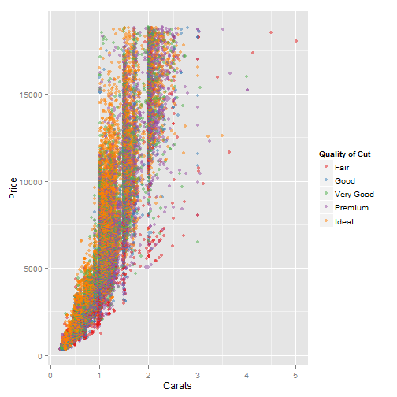

presentation
========================================================
author: Caitlin Bakker
date: July 2, 2016

Assignment
========================================================

This presentation is a component of the Developing Data Products Course Project. The first component was the creation of the Shiny application, which has been deployed on RStudio servers, while the second is this presentation, which was created with Slidify in RStudio. 

Introduction
========================================================

As seen in the plot below, diamonds are quite expensive for a variety of reasons. 

 

Diamonds Dataset
========================================================

This application is based on data from the diamonds dataset in ggplot2. The data set itself is quite large, as you can see from the below dimensions. 


```r
dim(diamonds)
```

```
[1] 53940    10
```

Available Criteria
========================================================

However, if you do want to purchase one, it's a good idea to have a budget and realistic expectations. This app is designed to help you find a diamond that is within budget and meets your criteria. 

The following criteria are available:
- desired weight (in carats)
- length (in mm)
- width (in mm)
- depth (in mm)
- maximum budget

More Information
========================================================

- The application is available at: https://cb2016.shinyapps.io/dataproject/ 
- server.R and ui.R code is available at: https://github.com/cjbakker/shiny
